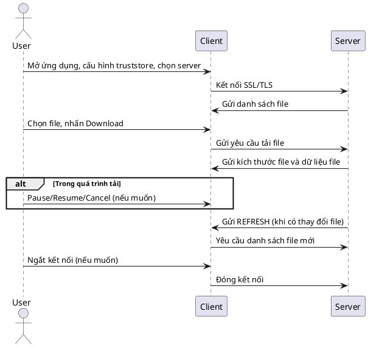

# Work Chart (Sơ đồ hoạt động) của Client và Server

## 1. Server

- **Khởi động server**
    - Đọc keystore, khởi tạo SSLServerSocket.
    - Lắng nghe kết nối từ client trên cổng được chỉ định.

- **Khi client kết nối**
    - Thêm client vào danh sách kết nối.
    - Hiển thị client trong giao diện quản lý.
    - Tạo một thread riêng để xử lý từng client.

- **Xử lý yêu cầu từ client**
    - Nếu client không gửi gì: gửi danh sách file hiện có.
    - Nếu client gửi tên file: kiểm tra file, gửi kích thước và dữ liệu file.
    - Nếu client gửi yêu cầu đặc biệt (ví dụ: tải một phần file): gửi đúng phần dữ liệu.

- **Quản lý file**
    - Thêm/xóa file trong thư mục Assets (qua giao diện).
    - Khi có thay đổi file, gửi thông báo REFRESH cho tất cả client.

- **Quản lý kết nối**
    - Hiển thị danh sách client đang kết nối.
    - Cho phép ngắt kết nối client bất kỳ từ giao diện.

---

## 2. Client

- **Khởi động client**
    - Hiển thị giao diện, cho phép cấu hình truststore, đường dẫn tải về, thông tin kết nối.

- **Kết nối tới server**
    - Đọc truststore, tạo kết nối SSL tới server.
    - Nhận danh sách file từ server và hiển thị.

- **Tải file**
    - Người dùng chọn file và nhấn Download.
    - Tạo thread tải file, hiển thị tiến trình, tốc độ, trạng thái.
    - Hỗ trợ tạm dừng, tiếp tục, hủy tải từng file.

- **Cập nhật danh sách file**
    - Khi nhận REFRESH từ server, tự động cập nhật lại danh sách file.

- **Quản lý đường dẫn tải về**
    - Cho phép thay đổi thư mục lưu file tải về.

---

## 3. Sơ đồ luồng chính

```
[Server] <---SSL/TLS---> [Client]
    ^                        ^
    |                        |
Quản lý file           Cấu hình truststore
Quản lý client         Chọn file tải về
Gửi REFRESH            Hiển thị tiến trình tải
```

---

## 4. Tóm tắt

- **Server:** Quản lý file, quản lý client, phục vụ file qua SSL, gửi thông báo cập nhật.
- **Client:** Kết nối bảo mật, tải file, quản lý tiến trình tải, tự động cập nhật danh sách file.

---

## 5. PlantUML Sequence Diagram


